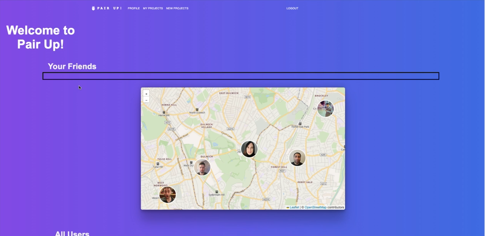

# Overview
- Building a (full stack) web app that allows users to signup, signin to Code Pairing App 
- Using the MERN stack and testing via Jest and Cypress 
- Connecting to Database via MongoDB

## Users Can
- Find Pair Parnters, see location, see availabilty and request to pair 
- See Github Profile of Pair Partners
- Add Pair Partners to friends list
- Find Projects and Create Projects to work on
- Video call with Pair Partners

# Group Collabrators (Alphabetical)

- [Care](https://github.com/clarebudds)
- [Chris](https://github.com/brownc2)
- [Naz H](https://github.com/nazhudha)
- [Patrick](https://github.com/PatrickReynoldsCoding)
- [Saif](https://github.com/shsn1990s)

# Technologies
MERN Stack

### Front End
- React - front-end framework
- React-router-dom - react app navigation
- Material UI React - Custom-Styled React Component Library

### Server

### Database
- MongoDB - document-oriented NoSQL database
- Mongo Atlas - hosted mongoDB production database
- Mongoose - ODM for MongoDB

### Autentication
- Passport JWT - issuance of JSON WEB TOKENS (based on public-key cryptography) used for user authorization purposes

### Testing
- Jest - JavaScript testing framework
- Cypress

# Headline specifications

* Any signed-up user can.....

# Screen Shots
 #### Login/Signup Pages
)
)

#### Main Page Features
)
)
)
)

# SETUP
